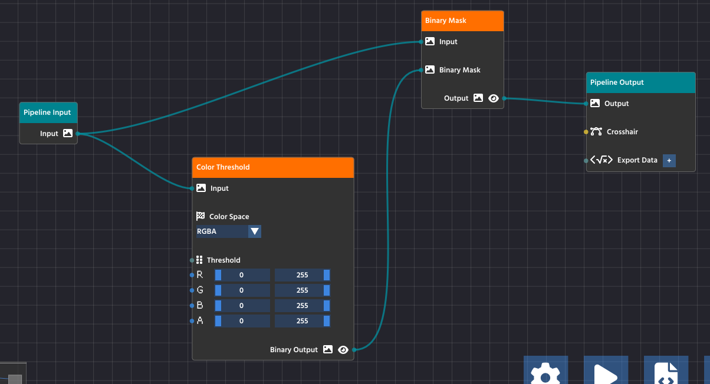

# Basics

When creating a new project, it is recommended to go through the "Guided Tour" to learn the basics of using the PaperVision editor. Click on the "Guided Tour" button when the welcome dialog comes up;

<figure><figcaption>
Welcome dialog featuring options to get started
</figcaption></figure>

In this guide, we'll go into detail through some key points that are mentioned on the Guided Tour.

## Input and Output Nodes

The starting two nodes when creating a new project serve as the entry point for your pipeline. The "Pipeline Input" feeds your algorithm with the images from the real-world, ready to be broken down into the steps needed to perform the detection you need.

While developing, you can choose various "Input Sources" to feed your pipeline with, for ease of use. You can use any USB webcam plugged into your computer, while images, videos, and HTTP stream sources are available as well!

The "Pipeline Output", as the name implies, helps you being able to visualize the result of your processing. Any image passed onto the output parameter will be promptly displayed when previewing the pipeline.

<figure><figcaption></figcaption></figure>

## Adding more nodes

<figure><figcaption></figcaption></figure> <figure><figcaption></figcaption></figure>

Click the **plus (+) button** or press the **SPACE** key to open the node library. Drag any node into your workspace to add new functionality to your pipeline. Use the **gear icon** for settings, the **play button** to run your pipeline, and the **code icon** to export your pipeline’s source code.

## Making your first link

<figure><figcaption></figcaption></figure>

To create a link, click and drag from the small circle (the output pin) on the right side of one node, like the Pipeline Input node, and release the mouse button over the small circle (the input pin) on the left side of another node, such as the Color Threshold node.


Pins are color-coded and feature small icons to represent the type of data they carry.&#x20;


You can only link pins of the same type:

* An Image Input pin, recognizable by its small image icon , must be linked to an Image Output pin.
* Other pins carry different data types (like numbers or shape attributes), each with its own specific icon and color.

When the connection is valid, the nodes will link together, allowing the data to flow from the output to the input.

## Ensuring the node flow is _complete_ and _valid_

<figure><figcaption></figcaption></figure>

For your pipeline to run successfully, data must flow seamlessly from the input all the way through to the output, and all processing steps must be properly configured. A valid and complete pipeline will always follow this pattern:

1. Pipeline Input: All processes must start from the Pipeline Input node, which serves as the entry point for the image or video stream.
2. Processing Chain: Intermediate processing nodes (like Color Threshold and Binary Mask) take data from a previous node's output and pass their processed result to the next node's input.
3. Pipeline Output: The final node in your chain must connect its processed data to the Pipeline Output node. This teal-colored node is the exit point for the processed image, making it available for viewing in the preview window (the `Output` pin) or for exporting (the `Export Data` pin).


Crucially, ensure that all nodes in the chain have their required parameters connected.&#x20;


In the case of the Color Threshold node, this means the image data is connected to its `Input` pin, but it also means that the threshold values (R, G, B, A sliders) are set either manually or are connected to another node's output to control the processing logic. A node with an unconfigured or unlinked required parameter will stop the pipeline from functioning correctly.

If your pipeline runs but produces no results, double-check that every node is connected and that the final processed image is successfully routed to the Output pin on the Pipeline Output node.
