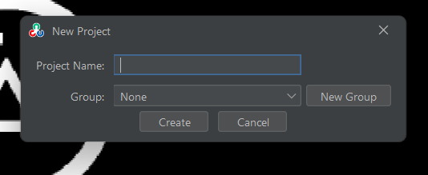

# Installing PaperVision

## Bundled with EOCV-Sim (recommended)

Starting from v4.0.0, PaperVision comes bundled with EOCV-Sim, making an all-in-one vision development suite.

To download the simulator, [follow the steps in the documentation](https://app.gitbook.com/s/-Mj4bZXgCUnwOLKFxDRi/downloading-eocv-sim).

<figure><figcaption><p>EOCV-SIm's welcome dialog featuring PaperVision</p></figcaption></figure>

### Refer to the PaperVision tab on the top right to start creating new projects

<figure><figcaption><p>PaperVision Tab in EOCV-Sim</p></figcaption></figure>

<figure><figcaption><p>Project creation window</p></figcaption></figure>

## Running from Gradle&#x20;

Use the following commands to run the project with Gradle, this will allow you to test the latest features and changes, building from source.

```bash
git clone https://github.com/deltacv/PaperVision.git
cd PaperVision
./gradlew runEv
```

\
PaperVision directly depends on EOCV-Sim to be able to run the pipelines in live previews, therefore, by running PaperVision this way, you won't have this functionality. Although, you'll still be able to use the editor and export the source code.

Only use this if you plan to contribute to PaperVision.
